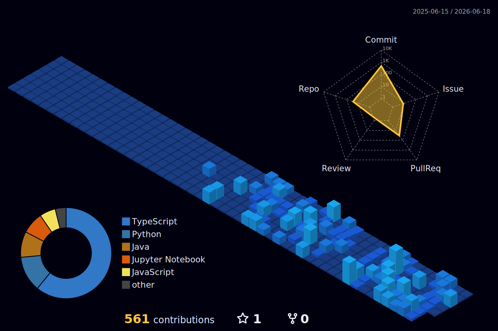

  

  
  
  
  

---

### About Me

I am a **Computer Science Engineering student** at **Vishwakarma Institute of Technology (VIT), Pune**, specializing in **Artificial Intelligence & Machine Learning** (Expected May 2027). 

I build high-performance backend systems and scale AI pipelines for real-world applications. My work focuses on distributed architectures, fault-tolerant system design, and sub-second latency optimization.

*   **Performance Driven:** Engineered production-grade systems serving 1,000+ users with **<450ms latency**.
*   **AI/ML Focus:** Experienced in LLM orchestration, RAG pipelines, and model fine-tuning/evaluation.
*   **Academics & Research:** Maintaining a **8.39 CGPA** with **2 IEEE publications** in AI-driven systems.

---

### Technical Toolbelt

<table width="100%">
  <tr>
    <td width="50%" valign="top">
      <h4>Backend &amp; Distributed Systems</h4>
      
      
      
      
      
      
      
      
    </td>
    <td width="50%" valign="top">
      <h4>Artificial Intelligence &amp; ML</h4>
      
      
      
      
      
      
    </td>
  </tr>
</table>

<table width="100%">
  <tr>
    <td width="50%" valign="top">
      <h4>Languages</h4>
      
      
      
      
      
      
    </td>
    <td width="50%" valign="top">
      <h4>Frontend &amp; Deployments</h4>
      
      
      
      
      
    </td>
  </tr>
</table>

---

### Professional Experience

*   **CodeSpyder Technologies** | **GenAI Intern** | *Feb 2026 – Present*
    *   Managing a team of **6 interns** developing a Learning Management System (LMS) scaling to **1,000+ users** and **100+ concurrent sessions**.
    *   Designed a FastAPI & Next.js backend with PostgreSQL (SQLAlchemy) via Supabase; engineered API Gateways & Rate Limiting services for **~200ms CRUD latency**.
    *   Implemented Llama 70B model for AI-enabled mock interviews, tuning error handling to reduce AI latency to **800–1000ms**.
*   **CanSpirit Artificial Intelligence** | **Software Engineering Intern - AI** | *Aug 2025 – Feb 2026*
    *   Developed an Emotion Analytics Detection system for disabled students, analyzing **1,000 videos at 5 FPS**.
    *   Implemented an Extra Trees algorithm achieving **88% accuracy**, outperforming Deep Learning baselines, KNN (78%), and Random Forest (83%).
    *   Ensured consistent **800–1000ms API latency** through structured pipeline logging and monitoring.

---

### Highlighted Projects

<table width="100%">
  <tr>
    <td width="50%" valign="top">
      <h4>HireMintora — AI Recruiting Platform</h4>
      
Real-time conversational AI screening using WebSockets, Groq (Llama 70B), TTS/STT, Monaco Editor, and Redis context caching.

      

        
      

      
<b>Impact:</b> Scaled to handle 50 concurrent WebSocket connections; automated reporting for 100+ users.

    </td>
    <td width="50%" valign="top">
      <h4>AutoDeck AI — Autonomous Slide Agent</h4>
      
Multi-agent pipeline (planner–executor) using FastAPI, JWT, Google OAuth, and GPT-3.5 Turbo to generate 5–10 slide decks in &lt;10 seconds with dynamic media.

      

        
      

      
<b>Impact:</b> Reduced manual presentation creation effort by 80% with real-time generations.

    </td>
  </tr>
</table>

<table width="100%">
  <tr>
    <td width="50%" valign="top">
      <h4>AdvocateGPT — RAG Legal Assistant</h4>
      
RAG pipeline embedding IPC text using Hugging Face (text-embedding-3) into FAISS, with MS MARCO Cross-Encoder reranking for legal precedent search.

      

        
      

      
<b>Impact:</b> Verified and measured retrieval effectiveness using Precision@k, Recall@k, and MRR.

    </td>
    <td width="50%" valign="top">
      <h4>MRI Brain Tumor Classification</h4>
      
Deep learning computer vision system for automated brain tumor detection from MRI scans using transfer learning with EfficientNet.

      

        
      

      
<b>Impact:</b> Automated screening process of complex medical image data with low classification latency.

    </td>
  </tr>
</table>

---

### Research & Achievements

*   **Research Publications:** Contributed to **2 IEEE publications** in conferences focusing on applications of AI and data-driven systems.
*   **Problem Solving:** Solved **250+ LeetCode problems** with a **1500+ contest rating** (strong Data Structures & Algorithms foundation).
*   **Leadership:** Managed a team of 10+ members for Vishwaconclave (stage, light, audio setups) and led 25 coordinators achieving **3,000+ registrations** during SWDC's Matadhikar campaign.

---

### Analytics & Contributions

  

 

<table width="100%">
  <tr>
    <td width="50%" align="center" valign="top">
      <h4>Contribution Activity</h4>
      
    </td>
    <td width="50%" align="center" valign="top">
      <h4>Commit Streak Metrics</h4>
      
    </td>
  </tr>
</table>

 

<table width="100%">
  <tr>
    <td width="50%" align="center" valign="top">
      <h4>General Profile Stats</h4>
      
    </td>
    <td width="50%" align="center" valign="top">
      <h4>Language Utilization</h4>
      
    </td>
  </tr>
</table>

 

  

